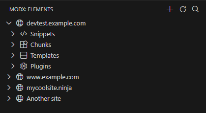
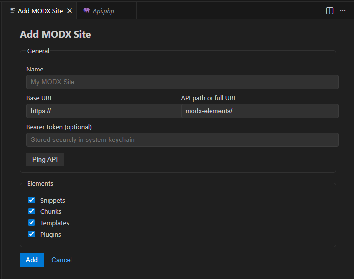

# MODX Elements 

This extension enables you to create and edit elements in your MODX sites via an API. This extension doesn't require an FTP connection, only an Extra installed on your MODX site.

## Requirements
- MODX 3 and above
- A simple REST API

## API
You can either create your own API or use one I've built spesific for this Extension. It will become available on [extras.modx.com](https://extras.modx.com/) later, but for now you can download and manually install from the [GitHub repo](https://github.com/henninghh990/extra_vscodemodxelements/releases).

## Multiple MODX sites
You can easilty add all your MODX sites and work with ease.

#### Explorer view

#### Adding a site

## Features
- Add multiple MODX sites
- Create, edit and rename Chunks, Snippets, Plugins and Templates

## Coming later
- Edit plugin events
- Work with files in Media Sources
- ... and maybe your suggestions!